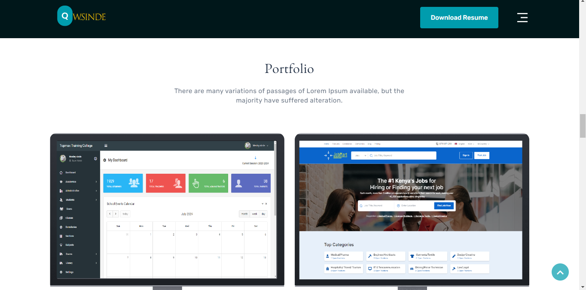
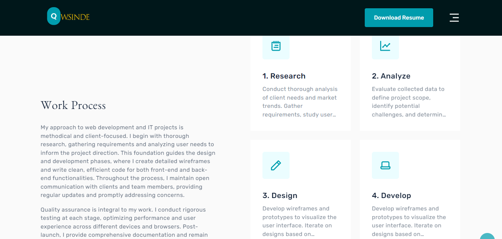

# Developer Portfolio





## 📌 Table of Contents

- [Overview](#overview)
- [Features](#features)
- [Technologies Used](#technologies-used)
- [Installation](#installation)
- [Usage](#usage)
- [Project Structure](#project-structure)
- [Customization](#customization)
- [Deployment](#deployment)
- [Contributing](#contributing)
- [License](#license)
- [Contact](#contact)

## 🌟 Overview

This Developer Portfolio is a responsive and interactive showcase of my skills, projects, and professional journey as a web developer. It's designed to highlight my expertise in HTML, CSS, and JavaScript while providing an engaging user experience.


## 🚀 Features

- Responsive design for seamless viewing on all devices
- Interactive project gallery
- Skills and technologies showcase
- About me section with professional summary
- Contact form for easy communication
- Smooth scrolling and animations

## 💻 Technologies Used

- HTML5
- CSS3 (with Flexbox/Grid for layout)
- JavaScript (ES6+)
- [Any additional libraries or frameworks you've used]

## 🛠 Installation

1. Clone the repository:
   ```
   git clone https://github.com/yourusername/developer-portfolio.git
   ```
2. Navigate to the project directory:
   ```
   cd developer-portfolio
   ```
3. Open `index.html` in your preferred browser.

## 🖥 Usage

Simply open the `index.html` file in a web browser to view the portfolio. Navigate through different sections using the menu or by scrolling.

## 📁 Project Structure

```
developer-portfolio/
│
├── index.html
├── css/
│   └── styles.css
├── js/
│   └── main.js
├── images/
│   ├── project1.jpg
│   ├── project2.jpg
│   └── ...
└── README.md
```

## 🎨 Customization

1. Replace the content in `index.html` with your personal information.
2. Update `styles.css` to match your preferred color scheme and layout.
3. Modify `main.js` to add any custom interactivity or features.
4. Add your project images to the `images/` directory and update references in the HTML.

## 🚀 Deployment

You can deploy this portfolio using GitHub Pages:

1. Go to your repository settings on GitHub.
2. Navigate to the "Pages" section.
3. Select the main branch as the source.
4. Click Save, and your portfolio will be live at `https://yourusername.github.io/developer-portfolio`.

## 🤝 Contributing

Contributions, issues, and feature requests are welcome! Feel free to check [issues page](https://github.com/yourusername/developer-portfolio/issues) if you want to contribute.

## 📄 License

This project is [MIT](https://choosealicense.com/licenses/mit/) licensed.

## 📬 Contact

Your Name - [your.email@example.com](mailto:your.email@example.com)

Project Link: [https://github.com/yourusername/developer-portfolio](https://github.com/yourusername/developer-portfolio)

---

⭐️ Don't forget to star this repo if you found it helpful!
